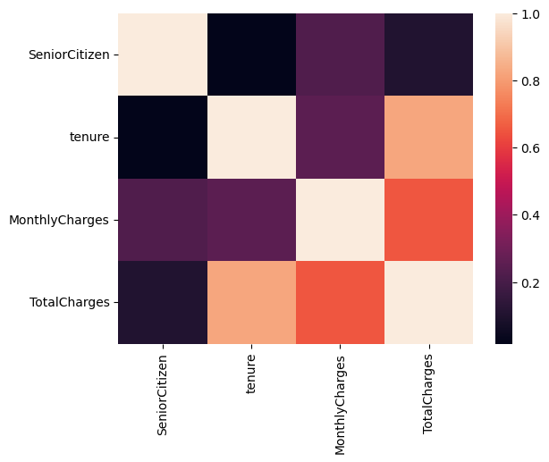

# churn_prediction
Project Overview:
The primary objective of this project is to develop a predictive model that can identify customers at risk of churning, enabling the company to take proactive measures to retain them.
------------
## Libraries Used 📚
 - NumPy – For arrays 
 - Pandas – For DataFrames, reading csv, etc.
 - Matplotlib – For Plotting graphs for analysis purpose
 - Seaborn – Based on matplotlib, advanced graphs
 - Scikit-Learn – For various models, data encoding, metrics, etc
 - XGBoost - For building and training the predictive model.
 - Warnings - ignore warning messages to keep the output clean

## Data used to Make Model 🎞️🎞️
 - Churn
 - Tenure
 - CustomerID
 - Gender
 - SeniorCitizen
 - Partner
 - Dependents
 - PhoneService
 - MultipleLines
 - InternetService
 - OnlineSecurity
 - DeviceProtection
 - TechSupport
 - StreamingTV
 - StreamingMovies
 - Contract
 - PaperlessBilling
 - PaymentMethod
 - MonthlyCharges
 - TotalCharges
dataset was downloaded from kaggle: (https://www.kaggle.com/datasets/blastchar/telco-customer-churn)

## Data Analysis - A Small Touch 📈📉

## What we will be predicting?  🤑

Predict customer churn in a telecom company.

## Dataset Used
https://www.kaggle.com/datasets/blastchar/telco-customer-churn

## Data Preparation
The data preparation steps include:

- Loading the dataset.
- Checking for null values and handling missing data.
- Dropping irrelevant columns (e.g., customerID).
- Converting data types for specific columns (e.g., TotalCharges).

## Exploratory Data Analysis (EDA)
EDA includes:

- As the time changed, the movie budget and gross increased as well.
- Plotting a heatmap to show correlations among numerical features.
- Visualizing the distribution of categorical features using pie charts.
- Analyzing tenure vs. churn distribution.

## Feature Engineering

Label encoding is applied to convert categorical variables into numerical values.

## Building the churn prediction model

- The data is split into training and testing sets with a 75:25 ratio.
- GridSearchCV is used to find the best hyperparameters for the XGBoost classifier.

## Model Evaluation

The best model is trained and evaluated using accuracy, precision, recall, F1-score, and ROC AUC score.

## Results

- Best Model Parameters: The optimal hyperparameters found using GridSearchCV.
- Model Performance:
-   Accuracy: 79.4%
-   Precision: 63.8%
-   Recall: 52.10%
-   F1-Score: 57.37%
-   ROC AUC Score: 70.6%
